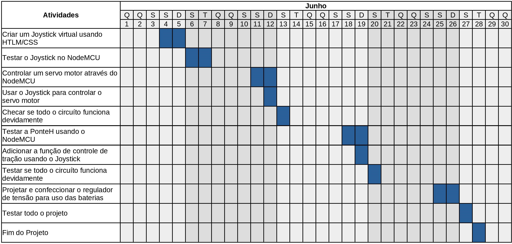

# RCCAR

Este é mais um projeto de carrinho de controle remoto, terá um tempo de execução e prazo de entrega, todos os conhecimentos adquiridos durante o processo serão organizados e disponibilizados neste repositório, para posteridade. Alguns objetivos foram marcados de modo a auxiliar o desenvolvimento do carrinho.

## Objetivos

* Reutilizar o chassi de outro carrinho;
* Adaptar um sistema de direção com controle de ângulo;
* Controle de velocidade;
* Faróis com acendimento remoto;
* Uso do NodeMCU para controle do sistema;
* Desenvolver um Joystick virtual embarcado.

## Justificativa

Este projeto tem como justificativa desenvolver as abilidades pessoais do autor, como: Gerenciamento de projetos, Git, Eletrônica e Desenvolvimento de Software.

## Cronograma

## Apoio

